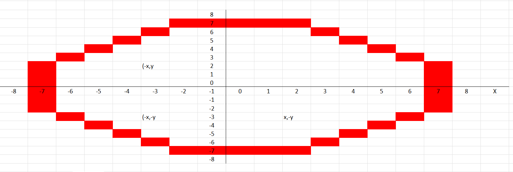
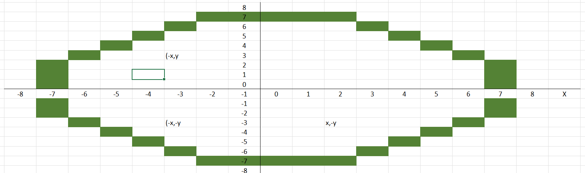
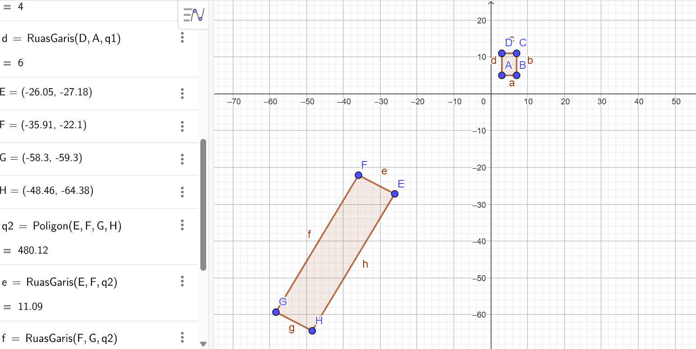
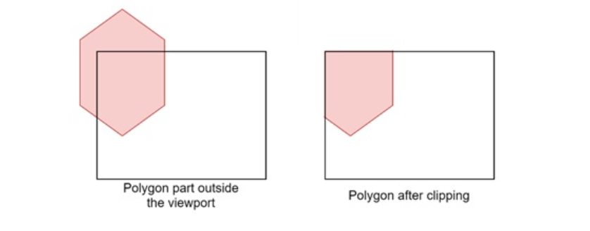

<html lang="id">
<head>
    <meta charset="UTF-8">
    <meta name="viewport" content="width=device-width, initial-scale=1.0">
    <title>Website Tugas Mahasiswa</title>
    <link rel="stylesheet" href="styles.css">
</head>
<body>
    

        <header>
            <h1 class="logo">Pendidikan Teknologi Informasi</h1>
        </header>
        <section class="hero">
            

                <h2>Hallo,   Nama Saya Ari Fardila</h2>
                
Mahasiswa Pendidikan Teknologi Informasi

                
NPM: 2413025063 | Kelas: 2024A

                
            

            

                
            

        </section>
        <section class="tasks">
            <h2>Tugas Grafika komputer:</h2>
        </section>
        <section class="algorithm">
            <h3>1. Prof. Daniel Thalmann</h3>
            

                
                

                    
Prof. Daniel Thalmann adalah seorang ilmuwan komputer Swiss 
                    dan Kanada serta pelopor dalam bidang Manusia Virtual. Saat 
                    ini dia menjabat sebagai Profesor Kehormatan di EPFL, Swiss dan
                    Direktur Pengembangan Penelitian di MIRALab Sarl i Jenewa, Swiss. 
                    Thalmann menerima gelar Doktor Kehormatan (Honoris Causa) dari Universitas Paul-Sabatier 
                    di Toulouse, Prancis, pada tahun 2003.Prof. Daniel Thalmann telah memberikan kontribusi signifikan dalam 
                    bidang grafika komputer,khususnya dalam pengembangan manusia virtual 
                    dan simulasi kerumunan.

                <section class="pdf-button">
                <a href="Ari Fardila_2413025063_Tokoh Grafika Komputer.pdf" target="_blank" class="btn-download">Laporan PDF</a>
                <a href="https://youtu.be/NEI-c6rpdL8?si=H4MdBr7v7zs7n-nn" target="_blank" class="btn-download">Video Materi</a>
                </section>   
                

            

            <h4> Berikut beberapa ilustrasi dari hasil karyanya:</h4>
            

                

                    
                    
<strong>Buku "Crowd Simulation"</strong>

                

                

                    
                    
<strong>Buku "Stepping Into Virtual Reality"</strong>

                

                

                    
                    
<strong>Artikel "A Global Human Walking Model with Real-Time Kinematic Personification"</strong>

                

                

                    
                    
<strong>Artikel "Challenges in Crowd Simulation"</strong>

                

            

        </section>

        <section class="algorithm">
            <h3>2. Algoritma Garis DDA</h3>
            

                
                
Algoritma DDA (Digital Differential Analyzer) adalah salah satu algoritma 
                    yang digunakan untuk menggambar garis lurus pada perangkat grafis raster 
                    (seperti layar komputer).Algoritma ini bekerja dengan menghitung titik-titik 
                    piksel yang paling mendekati lintasan garis lurus antara dua titik.

                <section class="pdf-button">
                <a href="Ari Fardila_2413025063_Pembuatan Garis DDA dan Bresenham.pdf" target="_blank" class="btn-download">Laporan PDF</a>
                <a href="https://youtu.be/BTJo3YPG7X4?si=XgxjHyvm-GxnpxUa" target="_blank" class="btn-download">Video Materi</a>
                </section>   
            

        </section>

        <section class="tables">
            <h3>A. Tabel dan Garis DDA di Excel</h3>
            

                
                
            

            <h3>B. Tabel dan Garis Bresenham di Excel</h3>
            

                
                
            

        </section>
        <section class="algorithm">
            <h3>3. Algoritma Lingkaran Bresenham dan Midpoint</h3>
            

                
                
Menggambar lingkaran Bresenham dan Midpoint dengan cara menentukan titik-titik 
                    piksel yang paling dekat dengan lintasan bentuk lingkaran tanpa menggunakan 
                    operasi trigonometri atau floating-point.

                <section class="pdf-button">
                <a href="Ari Fardila_2413025063_Pembuatan Lingkaran Bresenham dan Midpoint.pdf" target="_blank" class="btn-download">Laporan PDF</a>
                <a href="https://youtu.be/d4Gdpt2gIwA?si=kFoCvZl5JQ5MPZfQ" target="_blank" class="btn-download">Video Materi</a>
                </section>
            

        </section>
        <section class="tables">
            <h3>A. Tabel dan Lingkaran Bresenham di Excel</h3>
            

                
                
            

            <h3>B. Tabel dan Lingkaran Midpoint di Excel</h3>
            

                
                
            

        </section>
        <section class="algorithm">
            <h3>4. Algoritma Kurva Bezier</h3>
            

                
                
Kurva Bezier Cubic adalah kurva parametris yang menggunakan 4 titik kendali: titik awal, dua titik kontrol, dan titik akhir.

                <section class="pdf-button">
                <a href="Ari Fardila_2413025063_Kurva Bezier Cubic.pdf" target="_blank" class="btn-download">Laporan PDF</a>
                <a href="https://youtu.be/sK6uyAscqWU?si=i8fFssNluQdQ7_Mi" target="_blank" class="btn-download">Video Materi</a>
                </section>
            

        </section>
        <section class="tasks">
            <h2>Kuis Grafika komputer:</h2>
        </section>
         <section class="algorithm">
            <h3>1. Persamaan Misteri</h3>
            

                
                
Persamaan (x² + y² – 1)³ = x² y³  menggambarkan bentuk hati yang terletak di tengah bidang koordinat (0,0). Dalam canvas computer bentuknya digeser ke tengah layar dan digambar berdasarkan konversi koordinat kartesius ke koordinat layar piksel.

                <section class="pdf-button">
                <a href="Ari Fardila_2413025063_Kuis 1 Persamaan Misteri.pdf" target="_blank" class="btn-download">Laporan PDF</a>
                </section>
            

        </section>
        <section class="algorithm">
            <h3>2. Transformasi 2D</h3>
            

                
                
Transformasi 2D digunakan dalam grafika komputer untuk memanipulasi objek.

                <section class="pdf-button">
                <a href="Ari Fardila_2413025063_Kuis 2 transformasi 2D.pdf" target="_blank" class="btn-download">Laporan PDF</a>
                <a href="https://youtu.be/0od5IiQAM8s?si=lZUeLGeaRrPBBPvD" target="_blank" class="btn-download">Video Materi</a>
                <a href="https://docs.google.com/spreadsheets/d/1tmb2--ev_zDcJ7RAK-Rpcf62CkdNmhEVWY-d1U7iVvA/edit?usp=sharing" target="_blank" class="btn-download">Spreadsheet</a>
                </section>
            

        </section>
        <section class="algorithm">
            <h3>3. Line Clipping Algorithm</h3>
            

                
                
Line clipping adalah proses memotong garis yang terletak di luar area tampilan(viewport)sehingga hanya bagian yang terlihat saja yang digambar.

                <section class="pdf-button">
                <a href="Ari Fardila_2413025063_Kuis 3 Clipping Algorithm.pdf" target="_blank" class="btn-download">Laporan PDF</a>
                <a href="https://youtu.be/ISvM0Bgf5Wc?si=J52G6knumpqoMVkt" target="_blank" class="btn-download">Video Materi</a>
                <a href="https://docs.google.com/spreadsheets/d/12VBiNcMCchIq-1bZWDwDqoIVbD2Pus40eQvGZXQyUBM/edit?usp=sharing" target="_blank" class="btn-download">Spreadsheet</a>
                </section>
            

        </section>
        <section class="algorithm">
            <h3>4. Polygon Clipping Algorithm</h3>
            

                
                
Pemotongan poligon adalah proses menghilangkan bagian-bagian tertentu dari poligon yang berada di luar batas persegi panjang yang ditentukan.
                    disebutnya viewport. Tujuannya adalah untuk hanya menampilkan bagian poligon yang berada di dalam jendela. Setiap bagian poligon yang berada di luar jendela akan dipotong, 
                    memastikan bahwa poligon tersebut pas di dalam area tampilan.

                <section class="pdf-button">
                <a href="https://youtu.be/gHNmtMh9JLE?si=tV58jSmyisUHWmzg" target="_blank" class="btn-download">Video Materi</a>
                </section>
            

        </section>
    

</body>
</html>
